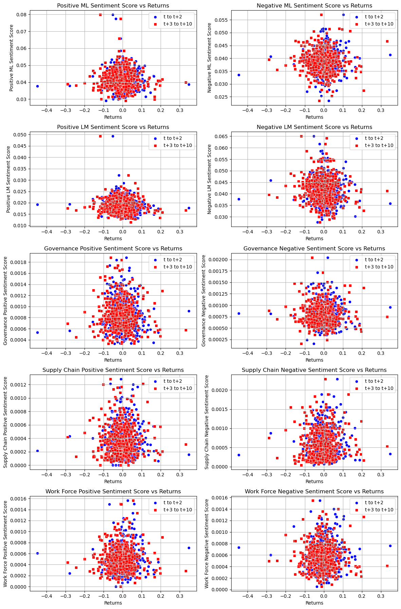

# Mid-term Report 

## Summary  

My report looks at all of the companies in the S&P 500 and their stock price returns after the release of their 10-K reports. The report gathers the returns of each companies stock for the day after the 10-K release and then the cumulative return from days 1-2 and days 3-10. Next, the report then analyzes the overall sentiment of the 10-K reports by using two BHR dictionaries (one positive and one negative) and an LM master dictionary. Then the report performs a contextual analysis that analyzes the sentiment around three topics - governance, supply chain, work force - and matches the returns of the stock to the sentiment for each category. All of the data pulled from the sentiment and contextual analysis is analyzed in the following report. I notice a potential conclusion in the overall negative and positive sentiment effects on stock return data, as well as one topic that should be investigated further. 

## Data

The sample is a download of companies in the S&P 500. I can't exactly figure out why, but my download only worked on 491 companies instead of 498 (which is what most of the class got). Either way, I used these 491 companies for the rest of my analysis.

The resulting final dataset which is stored in the outputs folder has the following information - 
- CIK
- Accession Number
- Filing Date
- ticker
- return in the day the company filed the 10K
- cumulative returns from the first two days after filing the 10K
- cumulative returns from days 3 to days 10 after filing the 10K
- The sentiment scores gathered using the LM and ML positive and negative dictionary
- The contextual sentiment scores gathered using the LM dictionary and a list of user genereated keywords for each of the three topics


#### Return Variables

The first step was to import the crsp_data which was provided and includes all of the stock return data needed for the analysis. This was then merged with the dataframe that included the CIK, Accession Number, Filing Date, and Ticker. I merged it on the ticker and filing date, and matched that with the ticker and date from the stock data in order to ensure that the return dates matched. 

```
df_with_tickers['Filing Date'] = pd.to_datetime(df_with_tickers['Filing Date'])
stock_data['date'] = pd.to_datetime(stock_data['date'])

merged_stocks = pd.merge(df_with_tickers, stock_data[['date', 'ticker','ret']],
                        left_on = ['ticker', 'Filing Date'],
                        right_on=['ticker','date'],
                        how='left')

merged_stocks.drop('date', axis = 1, inplace = True)

merged_stocks

```

To get the returns for the next 10 days, I used the .shift() function. I then merged the next 10 days of returns onto the merged_stocks dataframe. I then ran the following code to get the cumulative returns.

```
merged_stocks['cumulative_t_to_t2'] = (1 + merged_stocks['ret']) * (1 + merged_stocks['t+1']) * (1 + merged_stocks['t+2']) - 1
merged_stocks['cumulative_t3_to_t10'] = (1 + merged_stocks['t+3']) * (1 + merged_stocks['t+4']) * (1 + merged_stocks['t+5']) * (1 + merged_stocks['t+6']) * (1 + merged_stocks['t+7']) * (1 + merged_stocks['t+8']) * (1 + merged_stocks['t+9']) * (1 + merged_stocks['t+10']) - 1

merged_stocks
```


#### Sentiment Variables

To get the ML sentiment scores I followed these steps in my code - 
1. I loaded the list of negative and positive words that are provided in the inputs folder
2. Create a Regex pattern using the list of words that is case-insensitive and uses the re.compile() function
3. Extract the sentiment from the the 10K document. The CIK is used as the identifier and BeautifulSoup library is used to parse and clean the text
4. The code keeps a count of all of the negative words and divides that by the total word count of the text
5. Steps 1-4 are used as a process on loop for all of the 10K filings in the zip folder. The results are stored in a dataframe with the CIK in column 1 and the sentiment score in column 2.
6. This is the main execution that runs the functions listed above -
```
if __name__ == '__main__':
    negative_words_filepath = 'inputs/ML_negative_unigram.txt'
    sec_filings_zip = '10k_files/10k_files.zip'

    negative_terms = load_negative_words(negative_words_filepath)
    regex_pattern = create_negative_regex(negative_terms)
    negative_BHR_sentiment_data = analyze_10k_documents(sec_filings_zip, regex_pattern)

    print(negative_BHR_sentiment_data)

```

To get the ML sentiment scores I followed these steps which are similar but slightly different - 
1. Loaded the Master dictionary from the raw URL because importing it from the inputs folder was not working for me
2. Processed a single file and parsed it using BeautifulSoup. Count the occurences of LM negative and LM positive words that appear and divide each by the total words in the document
3. Run the above process on all the documents in the zip file
4. Below is my main execution for all of the functions above -
```
if __name__ == '__main__':
    zip_file_path = '10k_files/10k_files.zip'
    
    start_time = time.time()  
    
    LM_negative_df = process_zip(zip_file_path, num_files=491)
    
    print(LM_negative_df)
```

For the contextual sentiment analysis, each of the three topics had the exact same code. The only thing I changed was the words that I inputted to represent that topic. Below are the steps for how I did this part - 
1. Made my own list of keywords related to the topic and combined that with the positive terms
2. Used the Near_regex function to match the given keywords that appear within five words of the positive or negative words. Here is an example of what the regex function looked like -
```
governance_positive_regex = re.compile(NEAR_regex([governance, positive_terms_pattern], max_words_between=5, partial=False, cases_matter=False))
```
3. Then processed a single file and parsed through it using BeautifulSoup. Counts the occurences of that topics related terms near the positive or negative words. Divides that count by the total words in the document.
4. Ran the above process for all of the documents
5. Printed the results with the CIK in column 1 and the sentiment score in column 2


Some statistics - 
- 94 words in the ML negative dictionary
- 75 words in the ML positive dictionary
- 347 words in the LM positive dictionary
- 2345 words in the LM negative dictionary


#### Summary stats of the final analysis sample 

Below are some of the summary statistics of the final analysis sample 


```python
import matplotlib.pyplot as plt
import pandas as pd 
import seaborn as sns

file_path = 'output/analysis_sample.csv'
data = pd.read_csv(file_path)
df = pd.DataFrame(data)
df
```


<div>
<style scoped>
    .dataframe tbody tr th:only-of-type {
        vertical-align: middle;
    }

    .dataframe tbody tr th {
        vertical-align: top;
    }

    .dataframe thead th {
        text-align: right;
    }
</style>
<table border="1" class="dataframe">
  <thead>
    <tr style="text-align: right;">
      <th></th>
      <th>CIK</th>
      <th>Accession Number</th>
      <th>Filing Date</th>
      <th>ticker</th>
      <th>ret</th>
      <th>cumulative_t_to_t2</th>
      <th>cumulative_t3_to_t10</th>
      <th>Positive ML Sentiment Score</th>
      <th>Negative ML Sentiment Score</th>
      <th>Positive LM Sentiment Score</th>
      <th>Negative LM Sentiment Score</th>
      <th>Governance Positive Sentiment Score</th>
      <th>Governance Negative Sentiment Score</th>
      <th>Supply Chain Positive Sentiment Score</th>
      <th>Supply Chain Negative Sentiment Score</th>
      <th>Work Force Positive Sentiment Score</th>
      <th>Work Force Negative Sentiment Score</th>
    </tr>
  </thead>
  <tbody>
    <tr>
      <th>0</th>
      <td>1800</td>
      <td>0001104659-22-025141</td>
      <td>2022-02-18</td>
      <td>ABT</td>
      <td>-0.031431</td>
      <td>-0.027617</td>
      <td>0.013731</td>
      <td>0.036927</td>
      <td>0.036660</td>
      <td>0.013772</td>
      <td>0.037373</td>
      <td>0.000821</td>
      <td>0.000410</td>
      <td>0.000303</td>
      <td>0.000589</td>
      <td>0.000500</td>
      <td>0.000642</td>
    </tr>
    <tr>
      <th>1</th>
      <td>2488</td>
      <td>0000002488-22-000016</td>
      <td>2022-02-03</td>
      <td>AMD</td>
      <td>-0.021831</td>
      <td>0.007413</td>
      <td>-0.091372</td>
      <td>0.037331</td>
      <td>0.037781</td>
      <td>0.017415</td>
      <td>0.044509</td>
      <td>0.000864</td>
      <td>0.000720</td>
      <td>0.000612</td>
      <td>0.001331</td>
      <td>0.000414</td>
      <td>0.000576</td>
    </tr>
    <tr>
      <th>2</th>
      <td>2969</td>
      <td>0000002969-22-000054</td>
      <td>2022-11-22</td>
      <td>APD</td>
      <td>0.043015</td>
      <td>0.045545</td>
      <td>0.018296</td>
      <td>0.054153</td>
      <td>0.041740</td>
      <td>0.022021</td>
      <td>0.037519</td>
      <td>0.000989</td>
      <td>0.000886</td>
      <td>0.000546</td>
      <td>0.000886</td>
      <td>0.000458</td>
      <td>0.000472</td>
    </tr>
    <tr>
      <th>3</th>
      <td>4127</td>
      <td>0000004127-22-000038</td>
      <td>2022-11-23</td>
      <td>SWKS</td>
      <td>0.008601</td>
      <td>-0.031217</td>
      <td>0.043073</td>
      <td>0.042319</td>
      <td>0.038842</td>
      <td>0.017757</td>
      <td>0.039587</td>
      <td>0.000993</td>
      <td>0.000671</td>
      <td>0.000969</td>
      <td>0.001391</td>
      <td>0.000621</td>
      <td>0.000571</td>
    </tr>
    <tr>
      <th>4</th>
      <td>4281</td>
      <td>0000004281-22-000004</td>
      <td>2022-02-14</td>
      <td>HWM</td>
      <td>-0.007863</td>
      <td>0.040478</td>
      <td>-0.073328</td>
      <td>0.044700</td>
      <td>0.038538</td>
      <td>0.021313</td>
      <td>0.038999</td>
      <td>0.000845</td>
      <td>0.000983</td>
      <td>0.000169</td>
      <td>0.000553</td>
      <td>0.000446</td>
      <td>0.000983</td>
    </tr>
    <tr>
      <th>...</th>
      <td>...</td>
      <td>...</td>
      <td>...</td>
      <td>...</td>
      <td>...</td>
      <td>...</td>
      <td>...</td>
      <td>...</td>
      <td>...</td>
      <td>...</td>
      <td>...</td>
      <td>...</td>
      <td>...</td>
      <td>...</td>
      <td>...</td>
      <td>...</td>
      <td>...</td>
    </tr>
    <tr>
      <th>486</th>
      <td>1783180</td>
      <td>0001783180-22-000010</td>
      <td>2022-02-08</td>
      <td>CARR</td>
      <td>0.007437</td>
      <td>0.031277</td>
      <td>-0.070202</td>
      <td>0.047136</td>
      <td>0.037528</td>
      <td>0.021375</td>
      <td>0.043253</td>
      <td>0.000988</td>
      <td>0.000770</td>
      <td>0.000686</td>
      <td>0.000870</td>
      <td>0.000586</td>
      <td>0.000720</td>
    </tr>
    <tr>
      <th>487</th>
      <td>1792044</td>
      <td>0001792044-22-000010</td>
      <td>2022-02-28</td>
      <td>VTRS</td>
      <td>-0.242779</td>
      <td>-0.279230</td>
      <td>-0.063931</td>
      <td>0.037977</td>
      <td>0.040648</td>
      <td>0.019467</td>
      <td>0.045850</td>
      <td>0.000565</td>
      <td>0.000817</td>
      <td>0.000434</td>
      <td>0.000877</td>
      <td>0.000242</td>
      <td>0.000605</td>
    </tr>
    <tr>
      <th>488</th>
      <td>1811074</td>
      <td>0001811074-22-000014</td>
      <td>2022-02-23</td>
      <td>TPL</td>
      <td>0.012870</td>
      <td>0.066711</td>
      <td>0.209277</td>
      <td>0.041785</td>
      <td>0.027396</td>
      <td>0.015774</td>
      <td>0.032647</td>
      <td>0.001282</td>
      <td>0.001384</td>
      <td>0.000204</td>
      <td>0.000163</td>
      <td>0.000896</td>
      <td>0.001262</td>
    </tr>
    <tr>
      <th>489</th>
      <td>1841666</td>
      <td>0001784031-22-000009</td>
      <td>2022-02-22</td>
      <td>APA</td>
      <td>-0.034826</td>
      <td>0.004664</td>
      <td>0.195605</td>
      <td>0.038045</td>
      <td>0.034680</td>
      <td>0.013387</td>
      <td>0.040748</td>
      <td>0.000589</td>
      <td>0.000469</td>
      <td>0.000156</td>
      <td>0.000324</td>
      <td>0.000336</td>
      <td>0.000312</td>
    </tr>
    <tr>
      <th>490</th>
      <td>1868275</td>
      <td>0001868275-22-000020</td>
      <td>2022-02-25</td>
      <td>CEG</td>
      <td>-0.009251</td>
      <td>0.078294</td>
      <td>0.032015</td>
      <td>0.037725</td>
      <td>0.041131</td>
      <td>0.020015</td>
      <td>0.037370</td>
      <td>0.001014</td>
      <td>0.000884</td>
      <td>0.000459</td>
      <td>0.000494</td>
      <td>0.000555</td>
      <td>0.000710</td>
    </tr>
  </tbody>
</table>
<p>491 rows × 17 columns</p>
</div>


```python
print(df.shape)
print('')
print(df.columns)
print('')
print(df.describe)
```

    (491, 17)
    
    Index(['CIK', 'Accession Number', 'Filing Date', 'ticker', 'ret',
           'cumulative_t_to_t2', 'cumulative_t3_to_t10',
           'Positive ML Sentiment Score', 'Negative ML Sentiment Score',
           'Positive LM Sentiment Score', 'Negative LM Sentiment Score',
           'Governance Positive Sentiment Score',
           'Governance Negative Sentiment Score',
           'Supply Chain Positive Sentiment Score',
           'Supply Chain Negative Sentiment Score',
           'Work Force Positive Sentiment Score',
           'Work Force Negative Sentiment Score'],
          dtype='object')
    
    <bound method NDFrame.describe of          CIK      Accession Number Filing Date ticker       ret  \
    0       1800  0001104659-22-025141  2022-02-18    ABT -0.031431   
    1       2488  0000002488-22-000016  2022-02-03    AMD -0.021831   
    2       2969  0000002969-22-000054  2022-11-22    APD  0.043015   
    3       4127  0000004127-22-000038  2022-11-23   SWKS  0.008601   
    4       4281  0000004281-22-000004  2022-02-14    HWM -0.007863   
    ..       ...                   ...         ...    ...       ...   
    486  1783180  0001783180-22-000010  2022-02-08   CARR  0.007437   
    487  1792044  0001792044-22-000010  2022-02-28   VTRS -0.242779   
    488  1811074  0001811074-22-000014  2022-02-23    TPL  0.012870   
    489  1841666  0001784031-22-000009  2022-02-22    APA -0.034826   
    490  1868275  0001868275-22-000020  2022-02-25    CEG -0.009251   
    
         cumulative_t_to_t2  cumulative_t3_to_t10  Positive ML Sentiment Score  \
    0             -0.027617              0.013731                     0.036927   
    1              0.007413             -0.091372                     0.037331   
    2              0.045545              0.018296                     0.054153   
    3             -0.031217              0.043073                     0.042319   
    4              0.040478             -0.073328                     0.044700   
    ..                  ...                   ...                          ...   
    486            0.031277             -0.070202                     0.047136   
    487           -0.279230             -0.063931                     0.037977   
    488            0.066711              0.209277                     0.041785   
    489            0.004664              0.195605                     0.038045   
    490            0.078294              0.032015                     0.037725   
    
         Negative ML Sentiment Score  Positive LM Sentiment Score  \
    0                       0.036660                     0.013772   
    1                       0.037781                     0.017415   
    2                       0.041740                     0.022021   
    3                       0.038842                     0.017757   
    4                       0.038538                     0.021313   
    ..                           ...                          ...   
    486                     0.037528                     0.021375   
    487                     0.040648                     0.019467   
    488                     0.027396                     0.015774   
    489                     0.034680                     0.013387   
    490                     0.041131                     0.020015   
    
         Negative LM Sentiment Score  Governance Positive Sentiment Score  \
    0                       0.037373                             0.000821   
    1                       0.044509                             0.000864   
    2                       0.037519                             0.000989   
    3                       0.039587                             0.000993   
    4                       0.038999                             0.000845   
    ..                           ...                                  ...   
    486                     0.043253                             0.000988   
    487                     0.045850                             0.000565   
    488                     0.032647                             0.001282   
    489                     0.040748                             0.000589   
    490                     0.037370                             0.001014   
    
         Governance Negative Sentiment Score  \
    0                               0.000410   
    1                               0.000720   
    2                               0.000886   
    3                               0.000671   
    4                               0.000983   
    ..                                   ...   
    486                             0.000770   
    487                             0.000817   
    488                             0.001384   
    489                             0.000469   
    490                             0.000884   
    
         Supply Chain Positive Sentiment Score  \
    0                                 0.000303   
    1                                 0.000612   
    2                                 0.000546   
    3                                 0.000969   
    4                                 0.000169   
    ..                                     ...   
    486                               0.000686   
    487                               0.000434   
    488                               0.000204   
    489                               0.000156   
    490                               0.000459   
    
         Supply Chain Negative Sentiment Score  \
    0                                 0.000589   
    1                                 0.001331   
    2                                 0.000886   
    3                                 0.001391   
    4                                 0.000553   
    ..                                     ...   
    486                               0.000870   
    487                               0.000877   
    488                               0.000163   
    489                               0.000324   
    490                               0.000494   
    
         Work Force Positive Sentiment Score  Work Force Negative Sentiment Score  
    0                               0.000500                             0.000642  
    1                               0.000414                             0.000576  
    2                               0.000458                             0.000472  
    3                               0.000621                             0.000571  
    4                               0.000446                             0.000983  
    ..                                   ...                                  ...  
    486                             0.000586                             0.000720  
    487                             0.000242                             0.000605  
    488                             0.000896                             0.001262  
    489                             0.000336                             0.000312  
    490                             0.000555                             0.000710  
    
    [491 rows x 17 columns]>


#### Contextual sentiment discussion 

The three topics I chose for the contextual analysis were governance, supply chain, and workforce. For each topic I provided 15 keywords that were then ran through the near_regex function. As far as the smell tests: 

- Nothing seems immediately fishy. There are a few outliers scattered throughout the data and a couple of cells that don't have a sentiment value (really only a few). The data looks good.
- There is a lot of variation in the measures which is a good sign
- I don't think that the topics I chose and the keywords would favor any specific industry. Maybe if there is a company that makes supply chain logistics technology, than they would be effected.


Governance is an important topic to look at because investors want to understand the status of the company leadership and understand how the company operates. My original thought was that if a 10K signals a strong leadership, then investors will be optimistics and the returns will be better.

Supply chain is an important topic to look at because it is important to know if a company is operating with an efficient supply chain. If a company has a great product with high demand that is a great sign, but if the company can't actually deliver that product in an organized way then they have a real problem. Looking at supply chain sentiment in the 10Ks can help see if the company has a lot of positive or negative things to say about it.

Work force is an important topic to look at because the actual employees of a company is what makes the company work, and the employees can have a direct impact on the company's ability to produce a product and make money. Looking at the tone of sentiment related to the work force of a company can help us understand how the company is addressing certain issues and acknowledging goals. 

#### Any caveats?

There aren't any major issues with the dataset that will effect the analysis. The only issue I ran into is that a few of the companies are missing return data, 14 companies total. When I looked through the stock data in the crsp_data, I scrolled all the way to the dates for those companies and could not find the corresponding return data. I assume that this is fine, but I just wanted to make a note of it. 

## Results

Insert results and tables here 


```python
df
```


<div>
<style scoped>
    .dataframe tbody tr th:only-of-type {
        vertical-align: middle;
    }

    .dataframe tbody tr th {
        vertical-align: top;
    }

    .dataframe thead th {
        text-align: right;
    }
</style>
<table border="1" class="dataframe">
  <thead>
    <tr style="text-align: right;">
      <th></th>
      <th>CIK</th>
      <th>Accession Number</th>
      <th>Filing Date</th>
      <th>ticker</th>
      <th>ret</th>
      <th>cumulative_t_to_t2</th>
      <th>cumulative_t3_to_t10</th>
      <th>Positive ML Sentiment Score</th>
      <th>Negative ML Sentiment Score</th>
      <th>Positive LM Sentiment Score</th>
      <th>Negative LM Sentiment Score</th>
      <th>Governance Positive Sentiment Score</th>
      <th>Governance Negative Sentiment Score</th>
      <th>Supply Chain Positive Sentiment Score</th>
      <th>Supply Chain Negative Sentiment Score</th>
      <th>Work Force Positive Sentiment Score</th>
      <th>Work Force Negative Sentiment Score</th>
    </tr>
  </thead>
  <tbody>
    <tr>
      <th>0</th>
      <td>1800</td>
      <td>0001104659-22-025141</td>
      <td>2022-02-18</td>
      <td>ABT</td>
      <td>-0.031431</td>
      <td>-0.027617</td>
      <td>0.013731</td>
      <td>0.036927</td>
      <td>0.036660</td>
      <td>0.013772</td>
      <td>0.037373</td>
      <td>0.000821</td>
      <td>0.000410</td>
      <td>0.000303</td>
      <td>0.000589</td>
      <td>0.000500</td>
      <td>0.000642</td>
    </tr>
    <tr>
      <th>1</th>
      <td>2488</td>
      <td>0000002488-22-000016</td>
      <td>2022-02-03</td>
      <td>AMD</td>
      <td>-0.021831</td>
      <td>0.007413</td>
      <td>-0.091372</td>
      <td>0.037331</td>
      <td>0.037781</td>
      <td>0.017415</td>
      <td>0.044509</td>
      <td>0.000864</td>
      <td>0.000720</td>
      <td>0.000612</td>
      <td>0.001331</td>
      <td>0.000414</td>
      <td>0.000576</td>
    </tr>
    <tr>
      <th>2</th>
      <td>2969</td>
      <td>0000002969-22-000054</td>
      <td>2022-11-22</td>
      <td>APD</td>
      <td>0.043015</td>
      <td>0.045545</td>
      <td>0.018296</td>
      <td>0.054153</td>
      <td>0.041740</td>
      <td>0.022021</td>
      <td>0.037519</td>
      <td>0.000989</td>
      <td>0.000886</td>
      <td>0.000546</td>
      <td>0.000886</td>
      <td>0.000458</td>
      <td>0.000472</td>
    </tr>
    <tr>
      <th>3</th>
      <td>4127</td>
      <td>0000004127-22-000038</td>
      <td>2022-11-23</td>
      <td>SWKS</td>
      <td>0.008601</td>
      <td>-0.031217</td>
      <td>0.043073</td>
      <td>0.042319</td>
      <td>0.038842</td>
      <td>0.017757</td>
      <td>0.039587</td>
      <td>0.000993</td>
      <td>0.000671</td>
      <td>0.000969</td>
      <td>0.001391</td>
      <td>0.000621</td>
      <td>0.000571</td>
    </tr>
    <tr>
      <th>4</th>
      <td>4281</td>
      <td>0000004281-22-000004</td>
      <td>2022-02-14</td>
      <td>HWM</td>
      <td>-0.007863</td>
      <td>0.040478</td>
      <td>-0.073328</td>
      <td>0.044700</td>
      <td>0.038538</td>
      <td>0.021313</td>
      <td>0.038999</td>
      <td>0.000845</td>
      <td>0.000983</td>
      <td>0.000169</td>
      <td>0.000553</td>
      <td>0.000446</td>
      <td>0.000983</td>
    </tr>
    <tr>
      <th>...</th>
      <td>...</td>
      <td>...</td>
      <td>...</td>
      <td>...</td>
      <td>...</td>
      <td>...</td>
      <td>...</td>
      <td>...</td>
      <td>...</td>
      <td>...</td>
      <td>...</td>
      <td>...</td>
      <td>...</td>
      <td>...</td>
      <td>...</td>
      <td>...</td>
      <td>...</td>
    </tr>
    <tr>
      <th>486</th>
      <td>1783180</td>
      <td>0001783180-22-000010</td>
      <td>2022-02-08</td>
      <td>CARR</td>
      <td>0.007437</td>
      <td>0.031277</td>
      <td>-0.070202</td>
      <td>0.047136</td>
      <td>0.037528</td>
      <td>0.021375</td>
      <td>0.043253</td>
      <td>0.000988</td>
      <td>0.000770</td>
      <td>0.000686</td>
      <td>0.000870</td>
      <td>0.000586</td>
      <td>0.000720</td>
    </tr>
    <tr>
      <th>487</th>
      <td>1792044</td>
      <td>0001792044-22-000010</td>
      <td>2022-02-28</td>
      <td>VTRS</td>
      <td>-0.242779</td>
      <td>-0.279230</td>
      <td>-0.063931</td>
      <td>0.037977</td>
      <td>0.040648</td>
      <td>0.019467</td>
      <td>0.045850</td>
      <td>0.000565</td>
      <td>0.000817</td>
      <td>0.000434</td>
      <td>0.000877</td>
      <td>0.000242</td>
      <td>0.000605</td>
    </tr>
    <tr>
      <th>488</th>
      <td>1811074</td>
      <td>0001811074-22-000014</td>
      <td>2022-02-23</td>
      <td>TPL</td>
      <td>0.012870</td>
      <td>0.066711</td>
      <td>0.209277</td>
      <td>0.041785</td>
      <td>0.027396</td>
      <td>0.015774</td>
      <td>0.032647</td>
      <td>0.001282</td>
      <td>0.001384</td>
      <td>0.000204</td>
      <td>0.000163</td>
      <td>0.000896</td>
      <td>0.001262</td>
    </tr>
    <tr>
      <th>489</th>
      <td>1841666</td>
      <td>0001784031-22-000009</td>
      <td>2022-02-22</td>
      <td>APA</td>
      <td>-0.034826</td>
      <td>0.004664</td>
      <td>0.195605</td>
      <td>0.038045</td>
      <td>0.034680</td>
      <td>0.013387</td>
      <td>0.040748</td>
      <td>0.000589</td>
      <td>0.000469</td>
      <td>0.000156</td>
      <td>0.000324</td>
      <td>0.000336</td>
      <td>0.000312</td>
    </tr>
    <tr>
      <th>490</th>
      <td>1868275</td>
      <td>0001868275-22-000020</td>
      <td>2022-02-25</td>
      <td>CEG</td>
      <td>-0.009251</td>
      <td>0.078294</td>
      <td>0.032015</td>
      <td>0.037725</td>
      <td>0.041131</td>
      <td>0.020015</td>
      <td>0.037370</td>
      <td>0.001014</td>
      <td>0.000884</td>
      <td>0.000459</td>
      <td>0.000494</td>
      <td>0.000555</td>
      <td>0.000710</td>
    </tr>
  </tbody>
</table>
<p>491 rows × 17 columns</p>
</div>


```python
sentiment_columns = df.columns[7:]
return_columns = df.columns[4:7]

correlation_table = pd.DataFrame(index = sentiment_columns, columns = return_columns)

for sentiment in sentiment_columns:
    for ret in return_columns:
        correlation = df[sentiment].corr(df[ret])
        correlation_table.at[sentiment, ret] = correlation 


correlation_table


```


<div>
<style scoped>
    .dataframe tbody tr th:only-of-type {
        vertical-align: middle;
    }

    .dataframe tbody tr th {
        vertical-align: top;
    }

    .dataframe thead th {
        text-align: right;
    }
</style>
<table border="1" class="dataframe">
  <thead>
    <tr style="text-align: right;">
      <th></th>
      <th>ret</th>
      <th>cumulative_t_to_t2</th>
      <th>cumulative_t3_to_t10</th>
    </tr>
  </thead>
  <tbody>
    <tr>
      <th>Positive ML Sentiment Score</th>
      <td>-0.022024</td>
      <td>-0.036093</td>
      <td>-0.021867</td>
    </tr>
    <tr>
      <th>Negative ML Sentiment Score</th>
      <td>0.022411</td>
      <td>0.078703</td>
      <td>-0.02761</td>
    </tr>
    <tr>
      <th>Positive LM Sentiment Score</th>
      <td>-0.056868</td>
      <td>-0.144636</td>
      <td>-0.066265</td>
    </tr>
    <tr>
      <th>Negative LM Sentiment Score</th>
      <td>-0.011987</td>
      <td>-0.028421</td>
      <td>-0.066884</td>
    </tr>
    <tr>
      <th>Governance Positive Sentiment Score</th>
      <td>-0.036117</td>
      <td>-0.050179</td>
      <td>-0.032588</td>
    </tr>
    <tr>
      <th>Governance Negative Sentiment Score</th>
      <td>-0.007271</td>
      <td>-0.04584</td>
      <td>-0.065742</td>
    </tr>
    <tr>
      <th>Supply Chain Positive Sentiment Score</th>
      <td>-0.005263</td>
      <td>0.005222</td>
      <td>0.016861</td>
    </tr>
    <tr>
      <th>Supply Chain Negative Sentiment Score</th>
      <td>0.029763</td>
      <td>0.013548</td>
      <td>0.024093</td>
    </tr>
    <tr>
      <th>Work Force Positive Sentiment Score</th>
      <td>-0.038805</td>
      <td>0.021309</td>
      <td>0.010449</td>
    </tr>
    <tr>
      <th>Work Force Negative Sentiment Score</th>
      <td>-0.010912</td>
      <td>0.044552</td>
      <td>-0.040955</td>
    </tr>
  </tbody>
</table>
</div>


```python
sentiment_measures = [
    "Positive ML Sentiment Score", "Negative ML Sentiment Score",
    "Positive LM Sentiment Score", "Negative LM Sentiment Score",
    "Governance Positive Sentiment Score", "Governance Negative Sentiment Score",
    "Supply Chain Positive Sentiment Score", "Supply Chain Negative Sentiment Score",
    "Work Force Positive Sentiment Score", "Work Force Negative Sentiment Score"
]

fig, axes = plt.subplots(5, 2, figsize=(12, 18))  
axes = axes.flatten()  


for i, sentiment in enumerate(sentiment_measures):
    sns.scatterplot(ax=axes[i], x=df['cumulative_t_to_t2'], y=df[sentiment], label='t to t+2', marker='o', color='b')
    sns.scatterplot(ax=axes[i], x=df['cumulative_t3_to_t10'], y=df[sentiment], label='t+3 to t+10', marker='s', color='r')
    
    axes[i].set_title(f'{sentiment} vs Returns')
    axes[i].set_xlabel('Returns')
    axes[i].set_ylabel(sentiment)
    axes[i].legend()
    axes[i].grid(True)

plt.tight_layout()
plt.show()
```


    

    


#### More Results Analysis 


```python
negative_sums = correlation_table[correlation_table < 0].sum()
positive_sums = correlation_table[correlation_table > 0].sum()
summary_df = pd.DataFrame({'Negative Sum': negative_sums, 'Positive Sum': positive_sums})

print(summary_df)
print('')

positive_rows = correlation_table.filter(like="Positive", axis=0)
negative_rows = correlation_table.filter(like="Negative", axis=0)

positive_sentiment_sums = positive_rows.sum()
negative_sentiment_sums = negative_rows.sum()

sentiment_comparison_df = pd.DataFrame({
    'Positive Sentiment Sum': positive_sentiment_sums,
    'Negative Sentiment Sum': negative_sentiment_sums
})

print(sentiment_comparison_df)

```

                         Negative Sum Positive Sum
    ret                     -0.189247     0.052174
    cumulative_t_to_t2      -0.305168     0.163334
    cumulative_t3_to_t10    -0.321912     0.051403
    
                         Positive Sentiment Sum Negative Sentiment Sum
    ret                               -0.159076               0.022003
    cumulative_t_to_t2                -0.204377               0.062542
    cumulative_t3_to_t10               -0.09341              -0.177099


I thought it would be interesting to make the two tables above to get an overall look at two different effects of the data. These tables were made from the previous correlation table. 

The first table shows the overall sum of positive vs negative correlations. This was calculated by taking each of the 10 sentiments and adding the negative results together and adding the positive results together. From the results at each time period, the negative correlations are stronger than the positive correlations. This suggests that as sentiment increases, the overall returns actually tend to move in the opposite direction. In terms of the actual stock market and investors, this could mean that there is a significant amount of overreaction to sentiment that causes reversals in the returns. Too much overconfidence about a stock or too much underconfidence in a stock may actually have a reverse effect on the return. 

The second table adds the results of the positive sentiment scores and the results of the negative sentiment scores, regardless of whether or not those results are positive or negative. This gives us another interesting result, where the positive sentiment measurements are showing a consistently negative returns and the negative sentiment is showing a more positive return. This could mean that when inverstors see a lot of positive sentiment regarding a stock, they are actually more inclined to sell into that optimisim. This could be true from the results as well for the negative sentiment, but not to the same scale. 


### Four Discussion Topics


```python
correlation_table
```


<div>
<style scoped>
    .dataframe tbody tr th:only-of-type {
        vertical-align: middle;
    }

    .dataframe tbody tr th {
        vertical-align: top;
    }

    .dataframe thead th {
        text-align: right;
    }
</style>
<table border="1" class="dataframe">
  <thead>
    <tr style="text-align: right;">
      <th></th>
      <th>ret</th>
      <th>cumulative_t_to_t2</th>
      <th>cumulative_t3_to_t10</th>
    </tr>
  </thead>
  <tbody>
    <tr>
      <th>Positive ML Sentiment Score</th>
      <td>-0.022024</td>
      <td>-0.036093</td>
      <td>-0.021867</td>
    </tr>
    <tr>
      <th>Negative ML Sentiment Score</th>
      <td>0.022411</td>
      <td>0.078703</td>
      <td>-0.02761</td>
    </tr>
    <tr>
      <th>Positive LM Sentiment Score</th>
      <td>-0.056868</td>
      <td>-0.144636</td>
      <td>-0.066265</td>
    </tr>
    <tr>
      <th>Negative LM Sentiment Score</th>
      <td>-0.011987</td>
      <td>-0.028421</td>
      <td>-0.066884</td>
    </tr>
    <tr>
      <th>Governance Positive Sentiment Score</th>
      <td>-0.036117</td>
      <td>-0.050179</td>
      <td>-0.032588</td>
    </tr>
    <tr>
      <th>Governance Negative Sentiment Score</th>
      <td>-0.007271</td>
      <td>-0.04584</td>
      <td>-0.065742</td>
    </tr>
    <tr>
      <th>Supply Chain Positive Sentiment Score</th>
      <td>-0.005263</td>
      <td>0.005222</td>
      <td>0.016861</td>
    </tr>
    <tr>
      <th>Supply Chain Negative Sentiment Score</th>
      <td>0.029763</td>
      <td>0.013548</td>
      <td>0.024093</td>
    </tr>
    <tr>
      <th>Work Force Positive Sentiment Score</th>
      <td>-0.038805</td>
      <td>0.021309</td>
      <td>0.010449</td>
    </tr>
    <tr>
      <th>Work Force Negative Sentiment Score</th>
      <td>-0.010912</td>
      <td>0.044552</td>
      <td>-0.040955</td>
    </tr>
  </tbody>
</table>
</div>


Discussion topic 1 - 

For my results, the positive ML sentiment matched with a return of -0.022024 and the negative ML sentiment matched with a return of 0.022411. In this case scenario with the ML sentiments, the result was basically the opposite, with an inverse relationship as the positive sentiment correlated to a negative return and a negative score correlated to a postive return. For the LM sentiments, the positive LM sentiment matched with a return of -0.056868 and the negative LM sentiment matched with a return of -0.011987. While not clear opposites like the ML results, these results still show that the positive sentiment had a stronger negative correlation with the return than the negative sentiment. 


Discussion topic 2 -

My results for the first return variable are not exactly the same as the results in the ML_JFE.pdf, but there are actualy some similarities. For the LM positive and LM negative sentiment in the paper, the results are -0.14 and -0.06 respectively. My results for the LM positive and LM negative sentiment are -0.056 and -0.011 respectively. Even though my results for the LM are different, they are similar to the ML_JFE's results because both of the results are negative, and the LM positive is a stronger negative correlation than the LM negative. I think the ML_JFE paper decided to include many more firms and many more years and additional controls to make sure that the study is valid. There is a chance that my results were just a one off result since we only looked at one 10-K for each company. The results can change depending on the year so it is important that the actual study did a much more in depth analsysis. 

Discussion topic 3 - 

All of my contextual sentiment measures had a relationship with returns that were different than 0, but not all of them have a large enough difference to be notable. There is enough variation to investigate the workforce sentiment measure more. Work force seemed to have the biggest effect on sentiment, and there was a consistent positive cunnulative return from t0 to t2 and from t3 to t10. One interesting thing about the negative work force sentiment is that there was a strong swing from 0.044 in the cumulative return for t0 to t2, to a sentiment of -0.041 in the cumulative return for t3 to t10. The work force sentiment is important to look at further because not only is the work force crucial to a company's operations and production, but employment and the workforce is a key indicator that is used to understand the state of our economy. 

Discussion topic 4 - 

For the ML sentiment there is a difference between the positive sentiment and the negative sentiment. The positive sentiment and the negative sentiment is -0.022024 and 0.022411 respectively. This could mean that the positive sentiment is correlated with over-optimisic views about a stock, which results in people selling the stock and the returns going down, and vice versa with the negative sentiment. 
