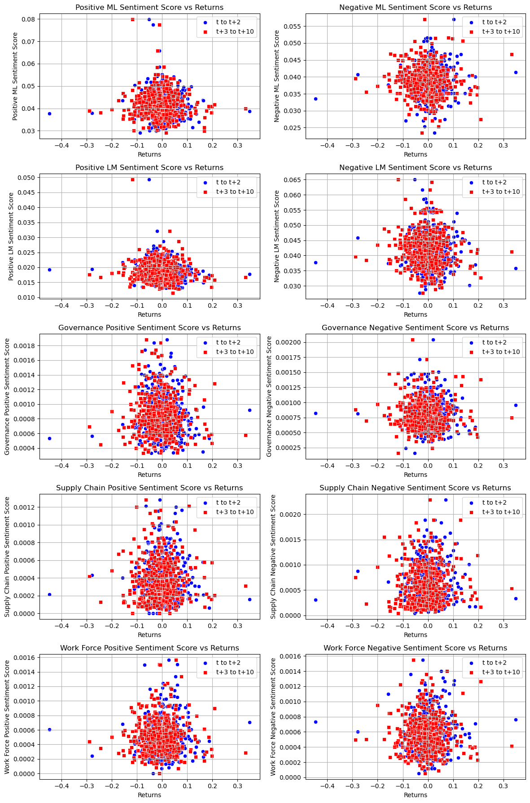
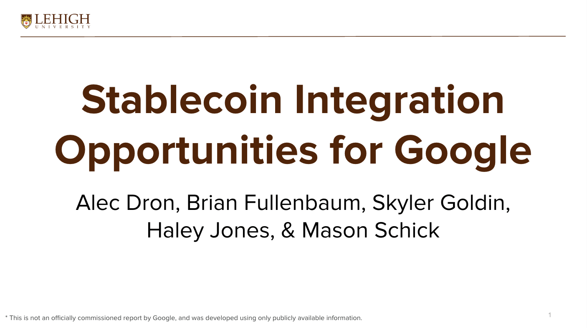

## About Me

Hi, my name is Brian Fullenbaum. I am a rising senior in the Lehigh Univerisity College of Business. I am pursuing a double major in Finance and Business Analytics and minoring in Data Science. 

<!-- Upload your own photo and change the path -->

  

---

## Portfolio

<!-- You can link to other websites, PDFs in this repo, and other pages in this repo -->

_**[Contextual Analysis of 10-Ks using NLP and relation to stock returns](report.md)**_

This report looks at the sentiments of 10-K reports, and comparing that to the returns of the stocks in the S&P 500 after the report's filing date. I picked three topics to look at (governance, supply chain, work force) and attempted to see how sentiment related to those topics in the 10-K will have an effect on the stock returns. The majority of the work considered creating the actual dataset, which includes company infomration, 10-K filing dates, returns over 10 days, and a 10 different sentiment measures. Below are the final scatterplot graphs that were created, and the link to the project report is above.

---

_**[Analyzing FED Announcements Dashboard](/pdf/sample_presentation.pdf)**_

---

_**[FinTech Capstone Project Spring 2025](/pdf/stablecoin_report.pdf)**_

---

## Career Objectives

Write what you want. 

Sell yourself!

---

## Hobbies

Maybe include a little about these, especially if they are the kinds of things that work well in interviews.

---

Page template forked from <a href="https://github.com/evanca/quick-portfolio">evanca</a>

<!-- Remove above link if you don't want to attibute -->
